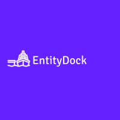

# EntityDock

EntityDock is a complete set of libraries as a complete SDK that comes with tools, utilities, and samples,
providing a lot of functionality and infrastructure for designing entity-oriented data applications.

The libraries are well defined by themes and in many cases hardly decoupled, 
offering different levels of solutions, where you can start from using 
the repository and service layers for entities offered by these 
libraries to the automatic generation of controllers, contexts,
UI, cohesion of services and a long etc.

The library set starts as said before by offering repository 
and generic service layers according to various types of entities,
that is, the implementation is offered and you only have to define
the classes that are going to be the entities. Even if your 
repository layer doesn't vary in methods from one entity to
another, using service injection you can access repository 
instances just by passing your entity type arguments. 
The repository implementation is equipped with various
additional methods to the typical "CRUD Functions", 
such as batch, operations, paging, etc. are written
to each new project. Then the service layer offers
a generic `DataService` implementation and several
declaration payloads of this class. This layer uses
the repository layer and adds support for entity mapping,
logging, and hooks. The service layer allows you to go straight
to the heart of your business logically everything else you have
to do declare because the solution is already implemented.

Parallel to the layer, these layers offer dynamic query methods,
to order, filter, do text searches, select, group, all dynamically,
for example, expose functionalities from a `webapi`. However after
the implementation of layers in business logic, other automations 
are offered, such as taking all the entities of an assembly and 
adding them to a specific `DbContext` or one that is even instantiated
past the types of entities or assembly that contains those entities.
From there you can jump straight to exposing various entity operations
to an MVC controller without even declaring the controllers or you may
even want to extend predefined generic controllers with your own. 
This allows you to have a REST API with very advanced features 
such as Joins, configurable text searches with endpoint for 
autocompletion, pagination and much more, very quickly and effortlessly.
In short, all this and much that ends even with the generation
of graphical interfaces in Blazor.